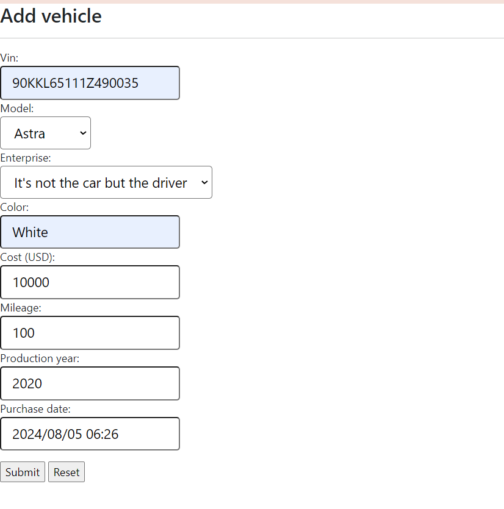

Vehicle Fleet - это приложение для управления автопарком. В автопарке есть компании, которые владеют автомобилями. Автомобили могут совершать поездки. 
Пользователь приложения - это менеджер компании, он может добавлять/редактировать/удалять машины автопарка через UI либо REST запросы.
Также есть возможность смотреть маршрут машины на карте, получить отчет по пробегу автомобиля за некоторый срок, а также сгенерировать случайный маршрут для машины, задав координаты начала и конца поездки.

Приложение состоит из 2-х микросервисов. Главный микросервис vehicle-fleet-boot отвечает за CRUD-операции с сущностями автопарка, предоставляет UI и rest-api. Второй микросервис generator-service, служит для генерации данных. С его помощью можно сгенерировать случайный маршрут для автомобиля, а также произвольное количество автомобилей со случайными параметрами.

Технологии:
- Spring Boot 3
- Java 17
- Spring Security
- Webflux (генерация координат для трека)
- Kafka
- Postgresql
- Docker
- C4

UI:
- Thymeleaf
- Bootstrap
- JavaScript

Работа с координатами:
- Nominatim - преобразование кардинаты в адрес
- Openrouteservice - генерация случайного маршрута
- Openstreetmap - отображение карт
- Leaflet (JavaScript lib) - отображение маршрута
- Postgis - хранение и обработка координат в БД

**Запуск**:

docker-compose -p vehicle-fleet -f docker-compose.prod.yml up -d

